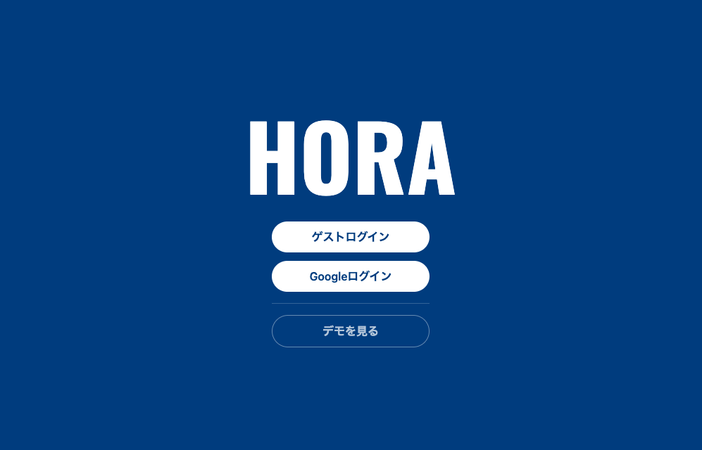
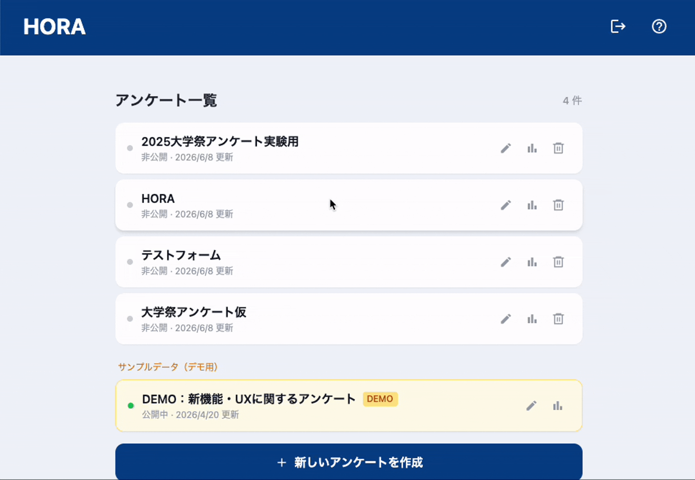
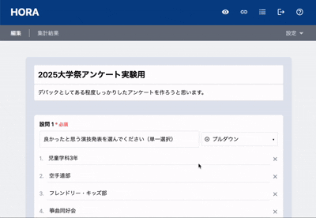
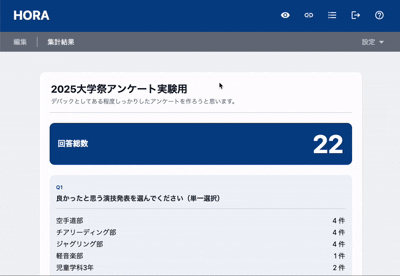
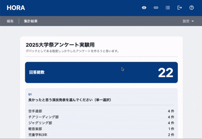

# HORA

<p align="center">
  
</p>

**HORA** は、アンケート・フォーム作成から回答収集、結果集計までを一貫して行える Web アプリケーションです。

「誰でも直感的にフォームを作成でき、かつ回答データの信頼性・管理性まで担保できること」をコンセプトに、個人開発として設計・実装しました。

単なるフォーム作成ツールに留まらず、

- 回答の不正防止
- 管理者と回答者それぞれの UX 配慮
- 実運用を想定した設定設計

を重視して開発しています。

---

## アプリURL

https://soundporco.github.io/HORA/

---

## 開発背景

私が大学で所属する大学祭運営委員会では、毎年出展団体を対象とした人気投票を実施しており、その集計には Googleフォーム が利用されていました。

しかし運営に携わる中で、一人の参加者が複数回投票していると思われるケースや、結果に不自然な偏りが見られることがありました。人気投票の上位団体には活動費が支給されるため、結果が団体の利益に直結する仕組みとなっており、「本当に公平な投票になっているのだろうか」という疑問を抱くようになりました。

もちろん Googleフォーム自体は非常に便利なサービスですが、大学祭の人気投票という用途においては、不正投票の防止や回答管理の面で物足りなさを感じていました。

そこで、「自分自身でアンケートフォームを開発し、より公平で信頼性の高い投票システムを運用できないだろうか」と考え、 **「フォーム作成に必要な本質的機能を、自分の手で設計・実装してみる」** ことを目的に HORA を開発をスタートしました。

このアプリでは、フォームの作成・公開・回答収集に加え、回答制限機能やランダム性、不正防止機能を実装し、実際の運用を想定したアンケートサービスの開発を意識した設計を行っています。

---

## 主な画面と機能

<!-- 1段目 -->

|                                                                                              ログイン画面                                                                                              |
| :----------------------------------------------------------------------------------------------------------------------------------------------------------------------------------------------------: |
|                                                                                                                                                         |
| ゲストログインとGoogleログインの２つから選択できる。Googleログインでは、作成したフォームや回答結果の情報をGoogleアカウントと紐付けて管理できる。アプリの雰囲気や使用感を知れるようにdemoモードも用意。 |

<!-- 2段目 -->

|                                                                                                                              アンケート一覧画面                                                                                                                              |
| :--------------------------------------------------------------------------------------------------------------------------------------------------------------------------------------------------------------------------------------------------------------------------: |
|                                                                                                                                                                                                                               |
| 今までに作成されたアンケートを一覧で確認することができ、ここから新規アンケートを作成することもできる。アンケートにはそれぞれタイトルと更新日、公開状態が表示される。サンプルデータにはあらかじめ用意したサンプルが表示されており、ここからアプリの使い方を学ぶことができる。 |

<!-- 3段目 -->

|                                                                                                         アンケート編集画面                                                                                                         |
| :--------------------------------------------------------------------------------------------------------------------------------------------------------------------------------------------------------------------------------: |
|                                                                                                                                                                                     |
| アンケートの作成、編集、公開が可能。回答形式はラジオボタン、チェックボックス、プルダウン、テキスト入力の４つに対応。必須回答の有無なども設定可能。また右上の設定から選択肢のシャッフルや、回答数の制限なども設定することができる。 |

<!-- 4段目 -->

|                                                                  アンケート集計結果                                                                  |
| :--------------------------------------------------------------------------------------------------------------------------------------------------: |
|                                                                                                       |
| アンケート集計結果は見やすさや直感的な表示を意識しました。元に大きく総回答数を表示し、回答形式に合わせたグラフ、配色、表示方法で回答を表示している。 |

<!-- 5段目 -->

|                                                                                           アンケート回答画面                                                                                            |
| :-----------------------------------------------------------------------------------------------------------------------------------------------------------------------------------------------------: |
|                                                                                                                                                          |
| アプリ上部のヘッダーにあるリンクボタンから回答画面、またそのURLにアクセスすることができる。ここではQRコードとURLの両方に対応しており、公開状態の有無に関わらず内容を確認できる。※回答の送信はできない。 |

---

## その他の機能

### フォーム設定（管理者向け）

- フォームの公開 / 非公開管理
- 二重回答の制御（Firebase.Authの匿名ログインを利用）
- プレビュー表示

### 結果・集計

- 回答データの取得・一覧化
- 設問タイプ別の表示方法
    - ラジオボタン / プルダウン：円グラフ
    - チェックボックス：棒グラフ
    - テキスト入力：回答一覧表示

---

## 技術スタック（Tech Stack）

### フロントエンド

- HTML / CSS / JavaScript
- React
- React Router
- Tailwind CSS

### バックエンド / インフラ

- Firebase
    - Firestore（データベース）
    - Firebase Authentication（認証）

---

## データ設計（例）

```txt
forms
 └─ formId
     ├─ title
     ├─ description
     ├─ questions[]
     ├─ published
     ├─ userId
     └─ updatedAt

answers
 └─ answerId
     ├─ formId
     ├─ answers
     └─ createdAt
```

- `userId` を保持することで、フォーム所有者の判別が可能
- 集計・管理・権限制御を見据えた構成

---

## 工夫したポイント

### 1.共通レイアウト設計

本アプリでは、

- 複数画面（編集・結果・プレビュー）で同一のフォームデータを扱う
- アプリの特性上、同一のフォームデータを複数の画面で共有するケースが多い（効率的なデータ管理が必要）
- 編集画面と結果画面を交互に行き来することが想定される（UXの観点からも、データの再取得を避けたい）

以上の理由から、
**React Router の Outlet を用いた共通レイアウト（EditLayout）** を採用しました。

- 親コンポーネントで Firestore からフォームデータを取得
- 子ページへ context としてデータを受け渡し
- 不要な再取得を防止

これにより、

> 「同じデータを必要とする画面は、共通の親で取得して配る」

という React の基本思想を反映しています。

---

### 2. 回答データの信頼性向上の工夫

このアプリの開発背景より、**「回答データの信頼性」** を重視した設計を意識して行っています。そのためにまず最初に行ったのがには、**「不正回答の防止」** でした。
　開発当初は、回答のたびに IP アドレスを記録して、同一 IP からの複数回答をブロックする仕組みを考えていました。しかし、IPアドレスは利用するネットワーク環境によって変化するほか、大学や公共Wi-Fiでは複数人が同じIPアドレスを共有する場合があります。そのため、不正回答の防止効果が限定的である一方、正当な利用者まで回答できなくなる可能性があると判断しました。
　そこで、Firebase Authentication の匿名ログイン機能を利用して、**「ユーザーごとに一意の ID を発行し、その ID をもとに回答の重複を防止する」** という方法を採用しました。これによりバックエンドで行う匿名ログインにより、ストレスの少ないUXを担保しながら、同一ユーザーからの複数回答を効果的に防止できるようになりました。

ですが匿名ログインはクッキーの削除やシークレットモードの利用などで簡単に回避できてしまうため、完全な不正防止策とは言えません。そのため **「不正回答のハードルを高くする」** 工夫も並行して行うことにしました。

まず回答のたびに任意で、**「回答内容をシャッフルする」** という機能を実装しました。これにより、同一ユーザーが複数回回答する場合でも、毎回異なる選択肢の順番で表示されるため、単純な反復作業による不正回答の難易度を上げることができます。

そのほかにも現在、　**「回答最短時間の設定」** や **「回答受付時間の設定」** といった機能も検討中で、これらを組み合わせることで、回答データの信頼性をさらに高めることができると考えています。

### 2. 回答データの信頼性向上の工夫

本アプリはアンケート結果を収集・分析することを目的としているため、**「回答データの信頼性を高めること」**を重要な設計方針の一つとしました。

#### 不正回答防止の仕組み

開発当初は、回答時にIPアドレスを記録し、同一IPアドレスからの複数回答を制限する方法を検討しました。しかし調査を進める中で、IPアドレスはネットワーク環境によって変化するほか、大学や公共Wi-Fiでは複数の利用者が同一IPアドレスを共有するケースもあることが分かりました。そのため、不正回答を十分に防げないだけでなく、正当な利用者まで回答できなくなる可能性があると判断し、この方式は採用しませんでした。

そこで、Firebase Authenticationの匿名認証を利用し、ユーザーごとに一意のUIDを発行する方式を採用しました。これにより、ユーザー登録やログイン操作を必要とせず、スムーズな回答体験（UX）を維持しながら、同一ユーザーによる重複回答を防止できるようにしています。

#### 完全な防止ではなく「ハードルを上げる」という考え方

一方で、匿名認証はCookieやブラウザデータの削除、シークレットモードの利用などによって回避できるため、完全な不正防止策ではありません。

そのため、本アプリでは**「完全に防ぐ」のではなく、「不正回答のコストを高める」**という考え方を採用しました。

その一つとして、回答時に選択肢をランダムに並び替える機能を実装しています。これにより、同一人物が繰り返し回答する場合でも毎回選択肢の順序が変化するため、機械的・反復的な不正回答を行いにくい設計としました。

さらに現在は、

- 回答に必要な最短時間の設定
- 回答受付時間の制限

などの機能も検討しています。これらを組み合わせることで、不正回答を完全に排除することは難しくても、回答データ全体の信頼性を高められると考えています。

### 3. 使いやすいUI設計

アンケートアプリの開発を考えた際に以下のような特徴や要件があると考えました。

- 編集画面と結果画面を行き来することが多い
- フォームの内容を確認しながら編集したい
- 公開非公開の切り替えを視覚的にわかりやすくしたい
- プレビューや設定、リンクなど、必要な機能にすぐアクセスできるようにしたい

これらの要件を満たすために、**「ヘッダーを２つに分割して配置する」** ・　**「編集画面と結果画面を共通のレイアウトで切り替える」** という設計を採用しました。これにより、必要な機能に迅速にアクセスできるだけでなく、編集と結果の切り替えもスムーズに行えるようになっています。

### 4. 実運用を意識した設計

- 管理者 / 回答者の役割分離
- Firestore のデータ構造を意識した state 設計
- 後から機能追加しやすい拡張性

---

## 学んだこと

- React における状態管理とデータフロー設計
- Firebase Authentication の監視とクリーンアップ
- Firestore を用いたデータ構造の設計
- 「機能」だけでなく「なぜその UI・設計なのか」を説明する重要性

---

## 今後の改善案

- 回答受付時間の設定
  ー 回答最短時間の設定
- グラフによる累計回答数のリアルタイム表示
- CSV / Excel エクスポート
- 回答データの分析機能（回答時間、離脱率など）

---

## 作者

GitHub: https://github.com/soundPorco
